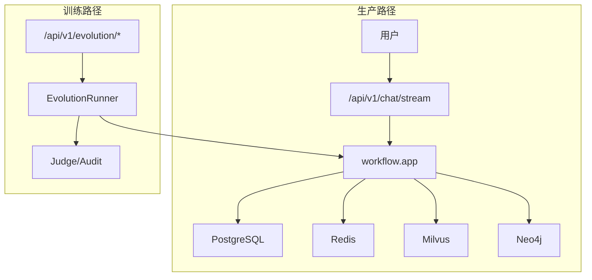
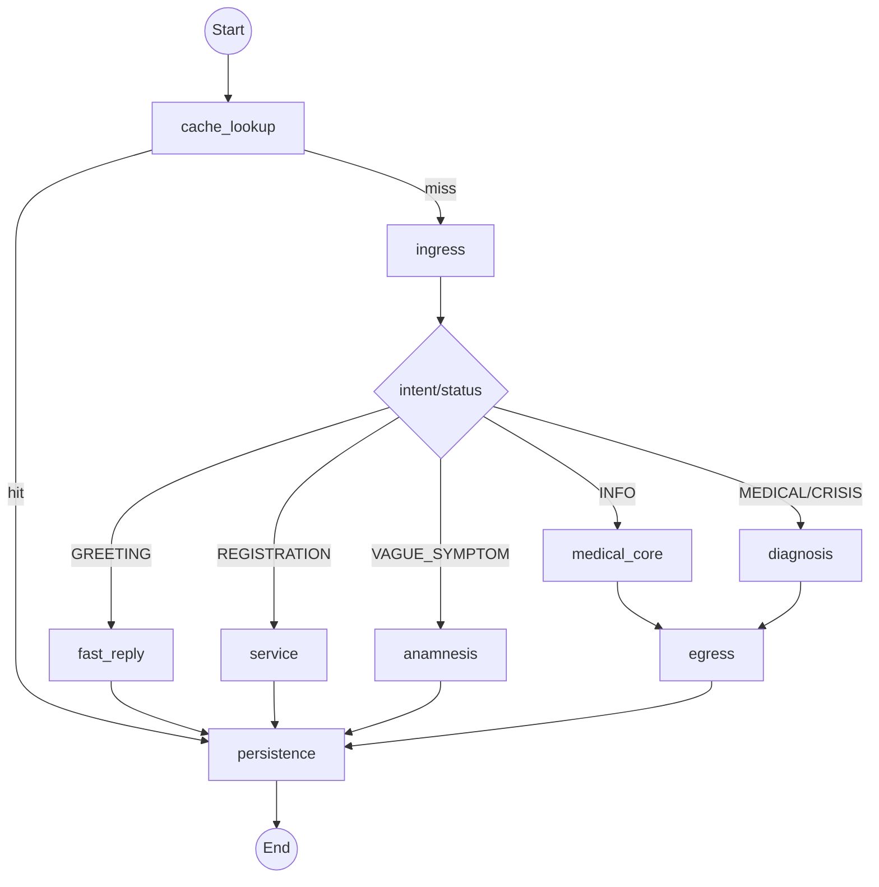

# 🏥 smart_hospital_agent

> 基于 LangGraph + FastAPI 的智能分诊与医疗问答系统，支持流式对话、意图分流、RAG 检索、服务闭环与训练演进。

---

## 1. 项目定位（保留原方案能力）

以下内容保留自原 README 的能力描述，作为项目目标基线：

- 隐私优先：PII 预处理与输出安全清洗。
- 多模型协同：云端主模型 + 节点池 + 本地能力回退。
- 危机场景优先：高危输入优先处理路径。
- 混合检索：Milvus + BM25 + 重排与图谱增强。
- 分诊分流：问候、挂号、医疗、危机等场景路由。
- 可观测性：链路日志、指标、回归脚本与诊断报告。

说明：上面是“目标能力蓝图”；当前公开发布版的实际落地情况见第 2 节与第 10 节。

---

## 2. 现状校准（2026-02-25）

本仓库是发布版快照，保留核心运行文件，剔除了日志、模型权重、测试杂项和多数历史文档。

当前与理想蓝图相比的关键状态：

- 已落地：`workflow` 主图、`Ingress/Diagnosis/Service/Egress` 子图、SSE 流式接口、RAG 主链路、数据库持久化脚本。
- 已落地：根目录 `.env` 作为单一配置源（`backend/.env` 不参与运行）。
- 已落地：Embedding/Reranker 的 CPU/GPU 可配置（`EMBEDDING_DEVICE` / `RERANKER_DEVICE`）。
- 待修复：发布版缺少 `backend/app/core/models/`，导致本地 SLM 相关导入失败。
- 待补齐：查询重写、自适应 K、分层索引等高级检索能力尚未进入主链。

---

## 3. 蓝图对齐（当前合理架构）

### 3.1 双模态主线（生产 + 训练）



### 3.2 Runtime 主图（代码真实态）



### 3.3 子图职责

- `Ingress`：PII 处理、多模态补强、历史注入、安全守卫、意图分类。
- `Diagnosis`：State Sync -> Hybrid Retriever -> Reasoner -> 报告/追问。
- `Service`：服务 Agent 与工具循环（查号、锁号、确认）。
- `Egress`：输出质量门禁、审计与最终持久化。

---

## 4. 详细目录结构（发布版）

```text
.
├── backend/
│   ├── alembic/
│   │   ├── env.py
│   │   └── versions/
│   ├── app/
│   │   ├── agents/
│   │   ├── api/
│   │   │   └── v1/endpoints/
│   │   │       ├── chat.py
│   │   │       ├── doctor.py
│   │   │       ├── auth.py
│   │   │       └── evolution.py
│   │   ├── core/
│   │   │   ├── graph/
│   │   │   │   ├── workflow.py
│   │   │   │   ├── nodes/
│   │   │   │   └── sub_graphs/
│   │   │   ├── llm/
│   │   │   ├── middleware/
│   │   │   ├── monitoring/
│   │   │   ├── prompts/
│   │   │   └── tools/
│   │   ├── db/
│   │   ├── rag/
│   │   │   ├── retriever.py
│   │   │   ├── reranker.py
│   │   │   └── graph_rag_service.py
│   │   ├── services/
│   │   │   ├── embedding.py
│   │   │   └── rag_service.py
│   │   └── main.py
│   ├── config/departments/
│   └── requirements.txt
├── database/
│   └── init_schema.sql
├── scripts/
│   ├── e2e_fullchain_logger.py
│   ├── e2e_cases_multiturn.json
│   ├── atomic_workflow_probe.py
│   └── start.sh
├── data/
│   ├── fine-tuning/
│   ├── huatuo_encyclopedia_qa/
│   └── *.jsonl / *.tsv / *.csv
├── docker-compose.yml
├── Dockerfile
└── README.md
```

---

## 5. 配置规则（必须）

项目采用根目录 `.env` 单一真源：

- 运行配置读取：`PROJECT_ROOT/.env`
- `backend/.env` 不应参与运行配置

最小示例：

```bash
OPENAI_MODEL_NAME=qwen-max
OPENAI_API_BASE=https://dashscope.aliyuncs.com/compatible-mode/v1
OPENAI_API_KEY=your_key

POSTGRES_SERVER=127.0.0.1
POSTGRES_PORT=5432
POSTGRES_USER=admin
POSTGRES_PASSWORD=admin123
POSTGRES_DB=smart_triage

REDIS_URL=redis://127.0.0.1:6379/0
MILVUS_HOST=127.0.0.1
MILVUS_PORT=19530

EMBEDDING_DEVICE=auto
RERANKER_DEVICE=auto
ENABLE_LOCAL_FALLBACK=false
```

---

## 6. 启动方式（本地代码运行）

### 6.1 安装依赖

```bash
cd /path/to/smart_hospital_agent
python -m venv .venv
source .venv/bin/activate
pip install -r backend/requirements.txt
```

### 6.2 启基础设施（可选 docker，仅基础设施）

```bash
docker compose up -d db redis etcd minio milvus-standalone
```

### 6.3 启后端

```bash
cd backend
source ../.venv/bin/activate
export PYTHONPATH=$(pwd)
uvicorn app.main:app --host 0.0.0.0 --port 8001
```

### 6.4 健康检查

```bash
curl http://127.0.0.1:8001/health
```

---

## 7. 核心接口

- `GET /health`
- `POST /api/v1/chat/stream`
- `POST /api/v1/evolution/start`
- `POST /api/v1/doctor/workflow`

SSE 示例：

```bash
curl -N -X POST "http://127.0.0.1:8001/api/v1/chat/stream" \
  -H "Content-Type: application/json" \
  -d '{"message":"我最近头痛恶心三天","session_id":"demo-001"}'
```

---

## 8. 全链路验证（E2E）

```bash
python scripts/e2e_fullchain_logger.py \
  --project-root . \
  --base-url http://127.0.0.1:8001 \
  --cases-file scripts/e2e_cases_multiturn.json \
  --backend-log-file logs/backend.log
```

输出目录：`logs/e2e_fullchain/<timestamp>/`

- `summary.json`
- `report.md`
- `cases.jsonl`

---

## 9. 模型与资源策略

- 云端主路径：`OPENAI_MODEL_NAME` + `OPENAI_API_BASE`
- 回退策略：节点池 -> 本地（受 `ENABLE_LOCAL_FALLBACK` 控制）
- 量化与本地：`LOCAL_SLM_QUANTIZATION` 在本地路径生效（具体依赖本地模型模块）
- 设备分配：
  - `EMBEDDING_DEVICE=cpu|cuda|auto`
  - `RERANKER_DEVICE=cpu|cuda|auto`

建议：在 8G 显存场景下优先保证主链可用，至少将 Embedding 或 Reranker 之一下放 CPU。

---

## 10. 仍需完成的修复与优化（按优先级）

### P0（阻塞可用性）

1. 补回 `backend/app/core/models/` 运行时代码（不含权重），修复 `ModuleNotFoundError: app.core.models`。
2. 完成本地意图与分诊链路的端到端验证，确保不因同步/异步适配报错中断。
3. 稳定 `/api/v1/chat/stream` 四类核心场景（greeting/registration/medical/crisis）输出。

### P1（诊断性与回归）

1. 继续增强 `scripts/e2e_fullchain_logger.py` 的路由/检索断言与失败分类。
2. 完成本地模型 vs 云端 vs 节点池的速度与意图正确率对比基线。
3. 补齐多轮同 session 的跨意图回归样例集。

### P2（检索质量演进）

1. Query Rewrite 节点（规则优先，模型兜底）。
2. 自适应 K 检索（按意图和查询复杂度动态调参）。
3. 分层索引（文档-章节-段落）与引用可追溯增强。

---

## 11. 已知问题

1. 未设置 `OPENAI_MODEL_NAME` 时会触发配置校验错误。
2. Milvus 不可达会导致检索路径降级或失败。
3. 发布版当前缺少 `backend/app/core/models/`，本地 SLM 相关功能不可用。

---

## 12. 诊断与排障建议

- 先验证 `/health`，再验证 `/api/v1/chat/stream`。
- 优先关注日志中的：`intent_classified`、`workflow_router_decision`、`hybrid_retriever_query`。
- 出现卡死优先看：`stall_timeout`、`case_timeout`、`event_count/token_count`。

---

## 13. 安全与发布约束

- 禁止提交：`.env`、密钥、模型权重、运行日志。
- 建议公开仓库仅保留核心代码、必要脚本、可公开数据。
- 生产前务必更换默认数据库口令和 API Key。

---

## 14. 历史版本记录（保留）

- V6.3 (2026-02-07): Safety & Consistency Update
- V6.2 (2026-02-02): Precision RAG & Data Alignment
- V6.1 (2026-01-31): Triage Routing + Self-Healing
- V6.0 (2026-01-31): Performance & Stability
- V5.0 (2026-01-30): LangChain 1.0 Re-Architecture

---

## 15. 外置仓库说明

为保持当前仓库结构聚焦，以下辅助仓库已迁移到上级目录 `/home/kkk/Project/`：

- `GPTQModel`
- `llama.cpp`
- `local_llama_factory`

详情见：[外置仓库路径说明](./docs/external_repositories.md)
