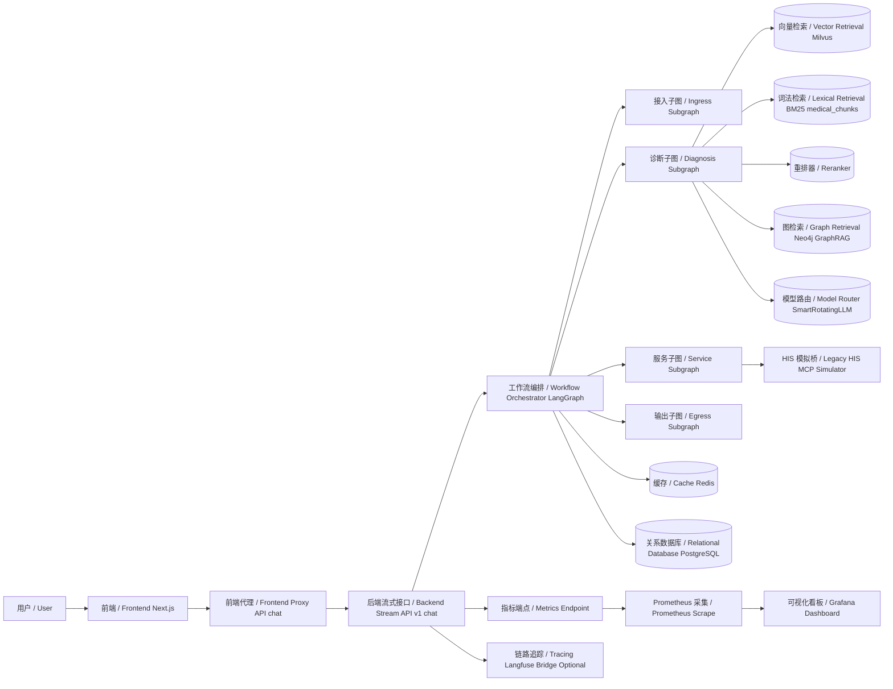
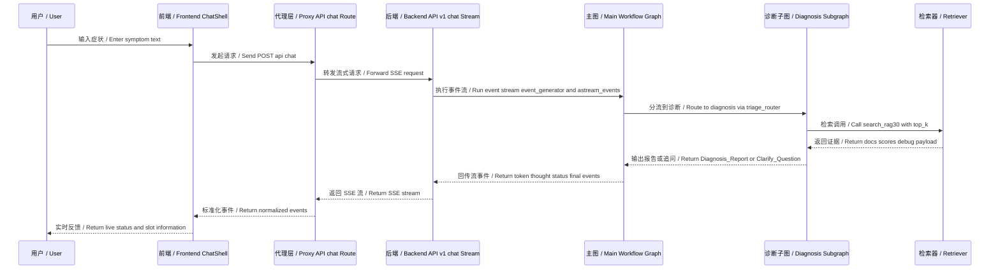
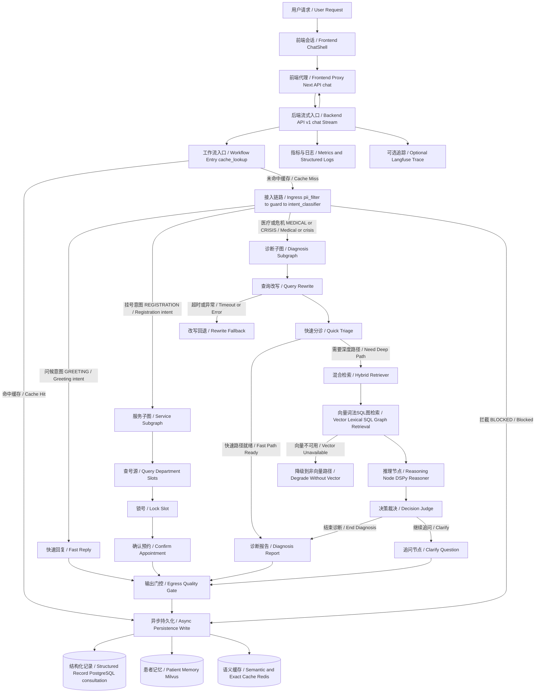

# smart_hospital_agent

面向医疗分诊与问答场景的 LangGraph + FastAPI + Next.js 系统，支持流式问诊、RAG 检索、挂号闭环、审计与演进测试。

## 项目简介（What / Why）

### 业务版（给老板看）/ Business View
- 工程定位：医疗场景 `Research Ops Control Plane`（研究能力 + 运营能力 + 治理能力三合一）。
- 这套系统要解决的不是“能不能回答”，而是“能不能稳定运营”：
- 信息分散：咨询、分诊、检索、挂号、支付状态分布在不同环节。当前已通过统一入口 `/api/v1/chat/stream` 和 `service` 子图把业务链路串起来。
- 响应滞后：传统问诊是“算完再回”，体验卡顿。当前采用 SSE 流式回传 `thought/token/status/final`，边推理边反馈。
- 输出不一致：不同模型、不同路径、不同参数容易导致口径漂移。当前通过 `Decision_Judge` + `quality_gate` + 审计日志把输出收敛到可治理口径。
- 端到端目标链路（老板视角）：请求理解 -> 风险与意图判断 -> 医疗推理/服务执行 -> 结果治理 -> 持久化留痕 -> 运营复盘。
- 用户侧核心能力（贴合当前产品形态）：
- 分析：症状输入后给出科室建议、诊断报告或追问，不只返回“聊天文本”。
- 监控：会话内可见实时状态流（例如 rewrite fallback、支付环节、错误事件）。
- 可视化：前端展示推理过程、号源卡片、支付状态、RAG 调试结果。
- 可靠性：云模型异常时仍可走回退链路，尽量保证服务不断线。
- 面向管理层的落地价值：把“AI 医疗能力”从演示功能，升级为可上线、可审计、可迭代的业务控制面。

### 技术版（给开发看）/ Technical View
- What（是什么）: 一个以 `backend/app/core/graph/workflow.py::create_agent_graph` 为核心的多子图医疗 Agent 系统，后端 FastAPI + LangGraph，前端 Next.js + SSE。
- Why（为什么）: 把“策略配置、执行编排、质量治理、故障降级、观测追踪、评测迭代”统一成同一个技术控制面，减少散点逻辑和线上不可控行为。
- 工程定位（Research Ops Control Plane）在本项目中的技术拆解：
- 策略平面（Policy Plane）：`backend/app/core/config.py` 统一托管模型路由、RAG 参数、RBAC、超时和回退开关；`frontend_new/app/settings/page.tsx` 支持运行时参数注入。
- 执行平面（Execution Plane）：`workflow` 主图调度 `ingress/diagnosis/service/egress`，把医疗问答和挂号流程放进同一执行图。
- 治理平面（Governance Plane）：`guard` 负责高风险拦截，`Decision_Judge` 负责诊断动作裁决，`quality_gate` 负责最终输出门禁。
- 数据平面（Data Plane）：`retriever` 聚合 Milvus、BM25、SQL 预过滤、GraphRAG；`persistence_node` 异步写入 PostgreSQL/Milvus/Redis。
- 观测平面（Observability Plane）：`/metrics` + 结构化日志 + Langfuse bridge，形成“实时监控 + 事后追踪”双视角。
- 演进平面（Evolution Plane）：`/api/v1/evolution/*` 与 `EvolutionRunner` 提供离线对抗、评分与改进闭环。
- E2E 目标链路（代码对应）：
- 请求理解：`Ingress`（`backend/app/core/graph/sub_graphs/ingress.py`）
- 检索与推理：`Diagnosis`（`backend/app/core/graph/sub_graphs/diagnosis.py`）
- 服务闭环：`Service`（`backend/app/core/graph/sub_graphs/service.py`）
- 输出治理：`Egress`（`backend/app/core/graph/sub_graphs/egress.py`）
- 降级治理：LLM 回退/重写回退/检索降级（`backend/app/core/llm/llm_factory.py`、`backend/app/core/graph/sub_graphs/diagnosis.py`、`backend/app/rag/modules/vector.py`）

## Repo Discovery（代码库发现）

### 目录与关键入口
- 后端入口：`backend/app/main.py`
- API 汇总：`backend/app/api/v1/api.py`
- 主工作流：`backend/app/core/graph/workflow.py`
- 诊断子图：`backend/app/core/graph/sub_graphs/diagnosis.py`
- 检索编排：`backend/app/rag/retriever.py`
- 前端入口：`frontend_new/app/page.tsx`
- 前端流式代理：`frontend_new/app/api/chat/route.ts`

### 主要服务/模块
- API 层：`chat`、`doctor`、`rag`、`auth`、`admin_rules`、`evolution`
- 图编排层：`Ingress/Medical Core/Diagnosis/Service/Egress`
- 检索层：Milvus 向量检索 + BM25 + Reranker + SQL 预过滤 + 语义缓存
- 模型层：云端 OpenAI-compatible 调用 + Key/模型轮转 + 节点池 + 本地回退
- 基础设施层：Postgres、Redis、Milvus、Neo4j、Prometheus、Grafana

### 数据流与依赖（含外部 API / 数据源 / Telegram）
- LLM 外部依赖：`OPENAI_API_BASE`/`OPENAI_MODEL_NAME`（`backend/app/core/config.py`、`backend/app/core/llm/llm_factory.py`）
- 向量数据源：Milvus collection（默认 `huatuo_knowledge`，`backend/app/rag/modules/vector.py`）
- 词法数据源：PostgreSQL `medical_chunks`（`backend/app/rag/modules/bm25.py::force_rebuild`）
- 图谱数据源：Neo4j（`backend/app/db/neo4j_client.py`）
- 挂号数据源：本地 HIS 模拟桥（`backend/app/services/mcp/his_server.py`）
- Telegram 交互：⚠️ Unknown/Needs verify
- 代码内未发现 Telegram SDK 或 Bot 路由（检索关键词 `telegram|aiogram|python-telegram-bot`）。
- 如计划接入，请优先检查 `backend/app/api/v1/endpoints/` 是否存在网关入口。

## 功能概览（用户视角）
- 流式问诊：用户输入症状，实时返回 thought/token/final 事件。
- 快速分诊：命中快速分诊路径时直接给出科室建议。
- 深度诊断：走检索与推理链路，生成诊断报告或追问。
- 挂号闭环：查询号源、锁号、支付确认（`BOOK:` / `PAY:`）。
- RAG 调试页：可直接调用 `/api/v1/rag/search` 并查看 BM25/Reranker 状态。
- 权限与审计：RBAC、SSO 映射、审计日志。
- 演进模式：支持后台 Evolution 循环与 SSE 观察。

## Feature Mapping（用户功能 -> 代码映射）
- 快速分析/问诊
- API: `backend/app/api/v1/endpoints/chat.py::stream_chat`
- 主流程: `backend/app/core/graph/workflow.py::triage_router`
- 快速分诊: `backend/app/core/graph/sub_graphs/diagnosis.py::quick_triage_node`
- 深度推理: `.../diagnosis.py::hybrid_retriever_node` + `dspy_reasoner_node`
- 报告与追问
- 报告: `.../diagnosis.py::generate_report_node`
- 追问: `.../diagnosis.py::generate_question_node`
- 挂号与支付
- 服务子图: `backend/app/core/graph/sub_graphs/service.py::ServiceGraph`
- 工具实现: `backend/app/services/mcp/his_server.py::HISService.get_department_slots/lock_slot/confirm_appointment`
- 快捷命令: `backend/app/api/v1/endpoints/chat.py::_emit_booking_shortcut`
- 状态查看
- 健康检查: `backend/app/main.py::health_check` (`/health`)
- RAG 状态: `backend/app/api/v1/endpoints/rag.py::rag_status` (`/api/v1/rag/status`)
- 前端状态栏: `frontend_new/app/rag/page.tsx::checkStatus`
- 管理能力
- 药物规则管理: `backend/app/api/v1/endpoints/admin_rules.py::create_interaction`
- 登录/RBAC/SSO 映射: `backend/app/api/v1/endpoints/auth.py`
- 演进与评测
- 启停与流式: `backend/app/api/v1/endpoints/evolution.py`
- 执行器: `backend/app/services/evolution_runner.py::EvolutionRunner`
- 新闻/监控提醒
- 新闻抓取：⚠️ Unknown/Needs verify（未发现 RSS/News pipeline）
- 主动提醒/定时告警：⚠️ Unknown/Needs verify（未发现 APScheduler/Celery/cron worker）

## 架构与模块（开发者视角 / Architecture & Modules）

### 模块分层（中文）
- 接入层：`frontend_new` + `backend/app/api/v1/endpoints/*`，负责请求接入、SSE 协议、参数注入。
- 编排层：`backend/app/core/graph/workflow.py`，负责主图路由与子图协同。
- 推理层：`backend/app/core/graph/sub_graphs/diagnosis.py`，负责 Query Rewrite、Hybrid Retriever、Reasoner、Decision Judge。
- 服务层：`backend/app/core/graph/sub_graphs/service.py` + `backend/app/services/mcp/his_server.py`，负责挂号工具闭环。
- 数据层：PostgreSQL、Redis、Milvus、Neo4j（`backend/app/db/*`、`backend/app/rag/*`）。
- 可观测层：`/metrics`、Langfuse bridge、结构化日志（`backend/app/core/middleware/instrumentation.py`、`backend/app/core/monitoring/langfuse_bridge.py`、`backend/app/core/logging/setup.py`）。

### Module Layers (English with Chinese Translation)
- Ingress/API Layer（接入层）: `frontend_new` and `backend/app/api/v1/endpoints/*` for request intake, SSE contracts, runtime knobs.
  中文：负责请求接入、流式协议对接和运行时参数透传。
- Orchestration Layer（编排层）: `backend/app/core/graph/workflow.py` for master routing and subgraph coordination.
  中文：负责主图路由和子图协同执行。
- Reasoning Layer（推理层）: `backend/app/core/graph/sub_graphs/diagnosis.py` for rewrite, retrieval, reasoning, and decision governance.
  中文：负责重写、检索、推理与诊断裁决。
- Service Layer（服务层）: `backend/app/core/graph/sub_graphs/service.py` + `backend/app/services/mcp/his_server.py` for appointment workflow execution.
  中文：负责挂号查询、锁号、支付确认等服务闭环。
- Data Layer（数据层）: PostgreSQL, Redis, Milvus, Neo4j adapters under `backend/app/db/*` and `backend/app/rag/*`.
  中文：负责结构化数据、缓存、向量检索和图谱检索的数据访问。
- Observability Layer（可观测层）: Prometheus `/metrics`, Langfuse bridge, structured logging.
  中文：负责指标监控、链路追踪和日志诊断。

### 组件关系图 / Component Topology


### 一次分析请求数据流图 / Request Data Flow


### 详细流程图（含降级治理）/ Detailed Flow (with Degradation & Governance)


## 数据源与证据口径（行情/新闻/指标，字段说明）

### 医疗知识与检索数据
- 向量检索来源：Milvus
- 代码：`backend/app/rag/modules/vector.py::search_by_vector`
- 返回字段：`content`、`department`、`score`、`source`、`id`
- 词法检索来源：PostgreSQL `medical_chunks`
- 代码：`backend/app/rag/modules/bm25.py::force_rebuild/search`
- 返回字段：`content`、`score`、`source`、`id`、`department`
- SQL 预过滤：`backend/app/rag/sql_prefilter.py`
- 过滤维度：`department`、`doc_type`

### 诊断输出数据契约
- 构造函数：`backend/app/core/graph/sub_graphs/diagnosis.py::_build_diagnosis_output`
- 关键字段：`department_top1`、`department_top3`、`confidence`、`reasoning`、`citations`

### 挂号数据字段
- 号源字段：`slot_id`、`doctor`、`time`、`fee`、`date`、`status`
- 订单字段：`order_id`、`payment_required`、`details`
- 代码：`backend/app/services/mcp/his_server.py`

### 行情/新闻/指标口径说明
- 行情（金融市场）: ⚠️ Unknown/Needs verify
- 新闻（RSS/新闻聚合）: ⚠️ Unknown/Needs verify
- 指标（系统与检索）: 已实现
- HTTP/RAG 指标：`backend/app/core/middleware/instrumentation.py`
- `/metrics` 暴露：`backend/app/main.py`

## 快速开始（安装、配置、运行）

### 1) Python 后端
```bash
cd /home/kkk/Project/smart_hospital_agent
python -m venv .venv
source .venv/bin/activate
pip install -r backend/requirements.txt
```

### 2) 启动依赖（可选 Docker）
```bash
docker compose up -d db redis etcd minio milvus-standalone prometheus grafana
```

### 3) 启动后端
```bash
cd backend
source ../.venv/bin/activate
uvicorn app.main:app --host 0.0.0.0 --port 8001
```

### 4) 启动前端
```bash
cd frontend_new
npm install
npm run dev
```

### 5) 健康检查
```bash
curl http://127.0.0.1:8001/health
curl http://127.0.0.1:8001/api/v1/rag/status
```

## 常用命令（测试、lint、运行脚本）
- 后端 API
```bash
cd backend
uvicorn app.main:app --host 0.0.0.0 --port 8001
```
- 前端开发
```bash
cd frontend_new
npm run dev
```
- 前端质量检查
```bash
cd frontend_new
npm run lint
npm run typecheck
```
- E2E 全链路日志脚本
```bash
python scripts/e2e_fullchain_logger.py \
  --project-root . \
  --base-url http://127.0.0.1:8001 \
  --cases-file scripts/e2e_cases_multiturn.json \
  --backend-log-file logs/backend.log
```
- Pytest（仓库中存在大量测试文件，按需选择）
```bash
pytest backend/tests -q
```

## 目录结构导览
```text
smart_hospital_agent/
├── backend/
│   ├── app/
│   │   ├── api/v1/endpoints/      # chat/doctor/rag/auth/admin/evolution
│   │   ├── core/graph/            # 主图与子图
│   │   ├── core/llm/              # 模型路由/回退
│   │   ├── rag/                   # 检索编排与适配器
│   │   ├── db/                    # SQLAlchemy/Neo4j
│   │   └── services/              # embedding/HIS/evolution
│   ├── requirements.txt
│   └── tests/
├── frontend_new/
│   ├── app/                       # 页面与 API proxy
│   ├── components/chat/           # ChatShell 与消息渲染
│   └── lib/                       # SSE 解析、运行时设置
├── scripts/                       # E2E/运维辅助脚本
├── docker-compose.yml
└── README.md
```

## 关键流程（一次 `/api/v1/chat/stream` 请求时序）
1. 前端 `ChatShell` 调用 `streamChat`，请求 `frontend_new/app/api/chat/route.ts`。
2. Next proxy 转发到后端 `POST /api/v1/chat/stream`，并做 SSE 事件标准化。
3. 后端 `event_generator` 调用 `graph_app.astream_events` 执行工作流。
4. `workflow::triage_router` 决定进入 `fast_reply`、`service`、`diagnosis` 等路径。
5. 若进入 `diagnosis`：`Query_Rewrite -> Quick_Triage -> Hybrid_Retriever -> DSPy_Reasoner`。
6. 输出 `token/thought/status/final`，并附加 `department_result`、`doctor_slots`、`payment_required` 等事件。
7. `persistence_node` 异步写入 Postgres/Milvus/Redis。

## Runtime & Ops（运行与运维）

### 配置项/环境变量（核心）
- 基础连接：`POSTGRES_*`、`DATABASE_URL`、`REDIS_URL`、`MILVUS_HOST`、`MILVUS_PORT`
- LLM：`OPENAI_API_BASE`、`OPENAI_API_KEY`、`OPENAI_MODEL_NAME`、`MODEL_CANDIDATES`
- 回退与容灾：`ENABLE_LOCAL_FALLBACK`、`DEEPSEEK_NODE_URLS`、`LLM_KEY_BLACKLIST_ENABLED`
- RAG：`RAG_PURE_RETRIEVAL_MODE`、`RAG_RERANK_CANDIDATE_K`、`RAG_CACHE_*`
- 运行时调优：`QUERY_REWRITE_TIMEOUT_SECONDS`、`CRISIS_FASTLANE_ENABLED`、`SSE_PING_INTERVAL_SECONDS`
- 安全/权限：`AUTH_RBAC_*`、`AUTH_SSO_*`
- 追踪：`LANGFUSE_*`

### 调度/后台任务
- 已实现后台任务
- FastAPI `BackgroundTasks`：`evolution start`、`admin rule cache refresh`
- `asyncio.create_task`：持久化异步写入、云健康检查、模型池监控
- 定时任务框架
- ⚠️ Unknown/Needs verify: 未发现 APScheduler/Celery 周期调度器

### 日志与监控
- 文件日志：`logs/backend.log`（`backend/app/core/logging/setup.py`）
- 请求追踪：`Request ID` 中间件（`backend/app/core/middleware/error_handler.py`）
- Prometheus：`/metrics`（`backend/app/main.py` + `instrumentation.py`）
- Langfuse：`langfuse_bridge`（可选开启）

### 失败降级与重试逻辑
- LLM
- Key 与模型轮转，认证失败可拉黑 key（`llm_factory.py`）
- 云端失败 -> DeepSeek 节点池 -> 本地模型/Mock（受配置控制）
- Query Rewrite
- 超时/错误回退到规则查询（`diagnosis.py::query_rewrite_node`）
- 可用 rewrite cache 降低重复请求开销
- 检索
- Milvus 连接失败时向量检索降级为空结果（`vector.py::connect/search_by_vector`）
- 语义缓存命中后做校验，不通过则降级回检索主链（`retriever.py::_verify_semantic_cache_hit`）
- HIS
- session 失效自动重鉴权并重试一次（`his_server.py::_legacy_call`）

## 故障排查（常见错误、降级模式、/status 解读）
- `GET /health` 返回 `ok` 但对话慢
- 检查 `logs/backend.log` 中是否出现 `query_rewrite_timeout_fallback`、`DSPy timeout`、`milvus_collection_load_failed`。
- `/api/v1/rag/status` 显示 `bm25_ready=false`
- 说明 BM25 索引未加载或未构建，检查 `bm25_async_load_*` 与 DB 连通性。
- `/api/v1/rag/status` 显示 `reranker_loaded=false`
- 检查 `settings.RERANKER_MODEL_PATH` 目录是否存在模型。
- SSE 频繁中断
- 检查 Next proxy 超时阈值（`CONNECT_TIMEOUT_MS/FIRST_EVENT_TIMEOUT_MS/TOTAL_TIMEOUT_MS`）与后端响应时长。
- 挂号失败
- 关注 `booking_error` 事件内容，检查 `HIS_MCP_MODE` 与 slot/order 参数。

## 安全与合规（爬虫/RSS/robots、内容展示边界）
- 数据脱敏
- 提供日志脱敏格式化器（`backend/app/core/middleware/logging.py::SensitiveFormatter`）
- 权限控制
- RBAC 角色校验与审计（`backend/app/core/security/rbac.py`、`auth_audit.py`）
- 医疗输出边界
- Guard 节点可拦截高风险输入（`backend/app/core/graph/nodes/guard.py`）
- 质量门控可拒绝低质量或高风险报告（`quality_gate.py`）
- 爬虫/RSS/robots
- ⚠️ Unknown/Needs verify: 当前仓库未发现新闻爬取/RSS 模块，暂无 robots 处理实现证据。

## Roadmap / TODO（基于代码与日志推断）
- 补齐主动监控提醒能力
- 当前是请求内实时状态，无独立定时告警任务。
- 补齐 Telegram/外部 IM 通道
- 代码未发现 Telegram Bot 接入。
- 收敛部署入口
- 根目录 `Dockerfile` 依赖 `requirements.txt`，仓库实际依赖在 `backend/requirements.txt`。
- ⚠️ Needs verify: 生产镜像是否使用 `backend/Dockerfile` 作为唯一入口。
- 强化前后端协议文档
- SSE 事件类型已较多，建议补 OpenAPI/SSE schema 文档并与前端类型自动对齐。
- 数据治理
- `data/`、`models/` 体量较大，建议长期改为 manifest + 拉取脚本模式。

## ⚠️ Unknown/Needs verify 清单
- Telegram 交互是否在私有分支实现。
- 新闻/RSS 模块是否在未纳入当前仓库的服务中。
- 生产容器构建到底使用 `Dockerfile` 还是 `backend/Dockerfile`。
- 是否有外部任务编排器（如系统 cron/K8s CronJob）在仓库外维护。
