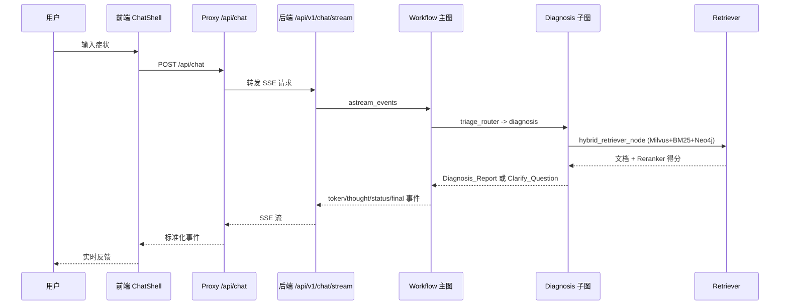
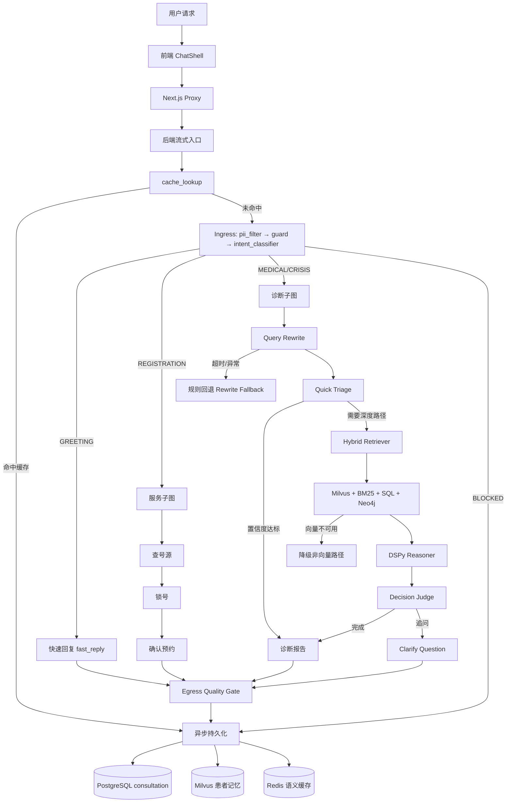

# smart_hospital_agent

面向医疗分诊与问答场景的 LangGraph + FastAPI + Next.js 系统，支持流式问诊、RAG 检索、挂号闭环、审计与演进测试。

## 项目简介（What / Why）

### 业务版（给老板看）
- 工程定位：医疗场景 `Research Ops Control Plane`（研究能力 + 运营能力 + 治理能力三合一）。
- 核心解决问题：
  - **信息分散**：统一入口 `/api/v1/chat/stream` + `service` 子图把全链路串起来。
  - **响应滞后**：SSE 流式回传 `thought/token/status/final`，边推理边反馈。
  - **输出不一致**：`Decision_Judge` + `quality_gate` + 审计日志把输出收敛到可治理口径。
- 端到端链路：请求理解 -> 风险与意图判断 -> 医疗推理/服务执行 -> 结果治理 -> 持久化留痕 -> 运营复盘。
- 用户侧核心能力：
  - **分析**：症状输入 -> 科室建议 + 诊断报告或追问。
  - **监控**：会话内可见实时状态流（rewrite fallback、支付环节、错误事件等）。
  - **可视化**：推理过程、号源卡片、支付状态、RAG 调试结果。
  - **可靠性**：云模型异常时走本地 SLM（DPO 微调版 Qwen3-0.6B）兜底。
- 面向管理层：把"AI 医疗能力"从演示功能升级为可上线、可审计、可迭代的业务控制面。

### 技术版（给开发看）
- **What**：以 `workflow.py::create_agent_graph` 为核心的多子图医疗 Agent，后端 FastAPI + LangGraph，前端 Next.js + SSE。
- **Why**：把策略配置、执行编排、质量治理、故障降级、观测追踪、评测迭代统一成同一个技术控制面。
- 技术拆解：
  - 策略平面（Policy Plane）：`config.py` 统一托管 70+ 配置项，模型路由/RAG 参数/RBAC/超时/回退开关全部运行时注入。
  - 执行平面（Execution Plane）：`workflow.py` 主图调度 `ingress/diagnosis/service/egress` 四子图。
  - 治理平面（Governance Plane）：`guard` 高风险拦截、`Decision_Judge` 诊断裁决、`quality_gate` 输出门禁。
  - 数据平面（Data Plane）：`retriever.py` 聚合 Milvus、BM25、SQL 预过滤、GraphRAG；`persistence_node` 异步写入 PostgreSQL/Milvus/Redis。
  - 观测平面（Observability Plane）：Prometheus `/metrics` + Langfuse bridge + cost_tracker + token_tracker。
  - 演进平面（Evolution Plane）：`/api/v1/evolution/*` + `EvolutionRunner` 提供离线对抗、评分与改进闭环。

### 架构风格（Workflow-first + Local Loops 混合型）
- `workflow-first`：主流程固定收敛，保证医疗安全边界与可追责性。
- `local loops`：子图内保留 Agent 自主性（工具调用、补充信息、服务闭环）。

| 维度 | 当前实现 | 代码证据 | 停止条件 |
|---|---|---|---|
| 主聊天链路 | 主图路由，统一落到持久化 | `workflow.py::create_agent_graph` | `persistence -> END` |
| 诊断单轮 | 重写/检索/推理/裁决后输出报告或追问 | `diagnosis.py::build_diagnosis_graph` | `Diagnosis_Report -> END` 或 `Clarify -> END` |
| 服务子图 agentic loop | 模型决定是否继续工具调用 | `service.py::ServiceGraph.build` | 无 `tool_calls` 后结束 |
| 医生工作流 agentic loop | `diagnosis -> tools -> updater -> diagnosis`，带审计重试 | `agents/doctor_graph.py` | 审计通过；高风险最多重试 2 次 |

---

## 本地模型体系（Qwen3-0.6B 全家桶）

本项目在 `models/` 目录下完整部署了 Qwen3-0.6B 全家桶，全部用于 RAG 管道和本地推理回退：

| 模型名称 | 用途 | 路径 | 配置项 |
|---|---|---|---|
| `Qwen3-Embedding-0.6B` | 向量嵌入（1024 维，均值池化+L2归一化） | `models/Qwen3-Embedding-0.6B/` | `EMBEDDING_MODEL_PATH` |
| `Qwen3-Reranker-0.6B` | 文档重排序（CausalLM Yes/No logit 打分） | `models/Qwen3-Reranker-0.6B/` | `RERANKER_MODEL_PATH` |
| `Qwen3-0.6B-Instruct` | 本地基础推理（回退链路） | `models/Qwen3-0.6B-Instruct/` | `LOCAL_SLM_URL` |
| `Qwen3-0.6B-DPO-v11_2-Clean` | **DPO 微调版**（医疗场景对齐；本地 SLM 主力） | `models/Qwen3-0.6B-DPO-v11_2-Clean/` | `LOCAL_SLM_MODEL=qwen3-0.6b-dpo-v11_2` |

### EmbeddingService 加速策略
文件：`backend/app/services/embedding.py`

加载优先级：`GGUF` > `ONNX (optimum/onnxruntime)` > `PyTorch`。

- **ONNX 路径**：若 `models/Qwen3-Embedding-0.6B/onnx/model.onnx` 存在，优先走 ONNX Runtime（支持 CUDA ExecutionProvider）。
- **PyTorch 路径**：`float16`（CUDA）/ `float32`（CPU），自动均值池化。
- **降级模式**：模型加载失败时返回 1024 维零向量，不阻断服务。
- **VRAM 管理**：注册到 `VRAMManager`，按需 offload/reload，避免 OOM。

### QwenReranker 加速策略
文件：`backend/app/rag/reranker.py`

- Qwen3-Reranker 架构为 **CausalLM**，打分方式：提取最后一个 Token 的 Yes/No logit → log_softmax → Yes 概率即为相关性得分。
- 同样支持 ONNX Runtime（`onnxruntime CUDAExecutionProvider`）加速，回退 PyTorch float16。
- 异步接口：`arerank()`（内部通过 `asyncio.to_thread` 包装）。

### DPO 微调版本说明
- 版本：`DPO-v11_2`，对应存档文件 `models/dpo_v11_2_merged.tar.gz`（~950MB）。
- 训练目标：医疗分诊对话对齐，降低幻觉率，提升中文指令遵从。
- 服务接入：通过 `LOCAL_SLM_URL`（默认 `http://localhost:8002/v1`）以 OpenAI-compatible API 暴露，`SmartRotatingLLM` 在云端全部失败后自动切换。

---

## 核心模块详解

### SmartRotatingLLM（多级回退 LLM 适配器）
文件：`backend/app/core/llm/llm_factory.py`，类 `SmartRotatingLLM`

```
云端 API Key 池 (轮转)
  ├─ Key 1 → [模型1, 模型2, ...] 逐模型尝试
  ├─ Key 2 → [模型1, ...] 同上
  └─ 认证失败 → 可选拉黑该 Key
        ↓ 全部失败
DeepSeek 节点池 (DEEPSEEK_NODE_URLS, Round-Robin)
        ↓ 全部失败
本地 SLM (Qwen3-0.6B-DPO-v11_2, 受 ENABLE_LOCAL_FALLBACK 控制)
```

关键特性：
- **多 Key 轮转**：`API_KEY_CANDIDATES` 池，支持 `DASHSCOPE_API_KEY_POOL` 逗号列表批量注入。
- **多模型轮询**：`MODEL_CANDIDATES_LIST`，单 Key 下可顺序尝试多个模型。
- **OpenAI Client Monkey Patch**：拦截所有 `openai.OpenAI` 构造，强制注入阿里云 base_url，防止 SDK 默认流向 OpenAI 官网。
- **PII 自动脱敏**：调用前通过 `PIIMasker.mask_messages()` 对 messages 做脱敏处理。
- **DashScope 兼容性修复**：非流式调用自动移除 `enable_thinking`；空 content 填充空格防止 400 错误。
- **CrewAI 兼容**：实现 `.call()` 接口，直接对接 CrewAI Agent。

### CrewAI 医疗专家组
文件：`backend/app/core/crew/expert_crew.py`，类 `MedicalExpertCrew`

三个角色：

| 角色 | 职责 | 工具 |
|---|---|---|
| `diagnostician`（诊断医生） | 症状分析、疾病推断、检查建议 | `SearchMedicalDB` |
| `pharmacist`（药剂师） | 用药建议、禁忌检查 | `SearchMedicalDB` + `DrugInteractionCheck` |
| `auditor`（审计员） | 合规审核、RBAC校验、证据核查 | — |

- 任务支持并行（`async_execution=True`）：诊断 + 药剂独立运行，审计汇总两者输出。
- Embedding 配置指向本地 `Qwen3-Embedding-0.6B`，无需调用外部 API。
- 证据溯源：诊断报告内含 `[EVIDENCE]` JSON 块，支持 `[PERSONA_UPDATE]` 患者画像更新指令。

---

## Repo Discovery（代码库发现）

### 目录与关键入口
- 后端入口：`backend/app/main.py`
- API 汇总：`backend/app/api/v1/api.py`
- 主工作流：`backend/app/core/graph/workflow.py`
- 诊断子图：`backend/app/core/graph/sub_graphs/diagnosis.py`
- 检索编排：`backend/app/rag/retriever.py`
- 前端入口：`frontend_new/app/page.tsx`
- 前端流式代理：`frontend_new/app/api/chat/route.ts`

### 主要服务/模块
- API 层：`chat`、`doctor`、`rag`、`auth`、`admin_rules`、`evolution`
- 图编排层：`Ingress/Diagnosis/Service/Egress` 四子图 + `doctor_graph.py` 医生工作流
- 检索层：Milvus 向量检索 + BM25 + Reranker + SQL 预过滤 + 语义缓存 + GraphRAG(Neo4j)
- 模型层：`SmartRotatingLLM`（云端轮转 + DeepSeek节点池 + 本地 SLM 三级回退）
- 专家组层：`MedicalExpertCrew`（CrewAI，diagnostician/pharmacist/auditor 三角色）
- 本地模型层：Qwen3-Embedding-0.6B / Qwen3-Reranker-0.6B / Qwen3-0.6B-DPO-v11_2
- 基础设施层：Postgres、Redis、Milvus、Neo4j、Prometheus、Grafana

### 数据流与依赖
- LLM 外部依赖：`OPENAI_API_BASE`（阿里云 DashScope）/ `OPENAI_MODEL_NAME`（如 `qwen-max,qwen-plus,qwen-turbo`）
- 向量数据源：Milvus collection（默认 `huatuo_knowledge`，HNSW 索引，1024 维 COSINE）
- 词法数据源：PostgreSQL `medical_chunks`（BM25 索引，`force_rebuild` 自动同步）
- 图谱数据源：Neo4j（`backend/app/db/neo4j_client.py`）
- 挂号数据源：本地 HIS 模拟桥 `backend/app/services/mcp/his_server.py`
- 历史记忆：Milvus（患者记忆）+ Redis（语义缓存/精确缓存）

---

## 功能概览（用户视角）
- **流式问诊**：症状输入，实时返回 `thought/token/status/final` 事件。
- **快速分诊**：命中快速路径时直接给出科室建议（可配置置信度阈值）。
- **深度诊断**：混合检索 + DSPy Reasoner + 诊断报告或追问，附带证据引用。
- **专家会诊**：CrewAI 三角色并行会诊（诊断 + 药剂 + 审计），支持动态创建科室专家。
- **挂号闭环**：查询号源、锁号、支付确认（`BOOK:` / `PAY:` 快捷命令）。
- **RAG 调试**：`/api/v1/rag/search` 可直接调试，查看 BM25/向量/Reranker 各路得分。
- **权限与审计**：RBAC 三角色（admin/operator/auditor）+ SSO 映射 + 操作审计日志。
- **演进模式**：后台 Evolution 循环 + SSE 实时观察评测过程。
- **成本与质量追踪**：`cost_tracker` 记录 Token 消耗，`quality_collector` 收集评测得分。

## Feature Mapping（用户功能 -> 代码映射）
- 快速分析/问诊
  - API: `backend/app/api/v1/endpoints/chat.py::stream_chat`
  - 主流程: `backend/app/core/graph/workflow.py::triage_router`
  - 快速分诊: `diagnosis.py::quick_triage_node`（置信度 ≥ `TRIAGE_FAST_CONFIDENCE_THRESHOLD`）
  - 深度推理: `hybrid_retriever_node` + `dspy_reasoner_node`
- 报告与追问
  - 报告: `diagnosis.py::generate_report_node`
  - 追问: `diagnosis.py::generate_question_node`
- 专家会诊
  - 编排: `backend/app/agents/doctor_graph.py`
  - 专家组: `backend/app/core/crew/expert_crew.py::MedicalExpertCrew`
  - 验证组: `backend/app/core/crew/verify_crew.py`
- 挂号与支付
  - 服务子图: `backend/app/core/graph/sub_graphs/service.py::ServiceGraph`
  - 工具实现: `backend/app/services/mcp/his_server.py::HISService`
  - 快捷命令: `chat.py::_emit_booking_shortcut`
- 状态查看
  - 健康检查: `backend/app/main.py::health_check` (`/health`)
  - RAG 状态: `rag.py::rag_status` (`/api/v1/rag/status`)
  - 前端状态栏: `frontend_new/app/rag/page.tsx::checkStatus`
- 管理能力
  - 药物规则管理: `admin_rules.py::create_interaction`
  - 登录/RBAC/SSO: `backend/app/api/v1/endpoints/auth.py`
- 演进与评测
  - 启停与流式: `backend/app/api/v1/endpoints/evolution.py`
  - 执行器: `backend/app/services/evolution_runner.py::EvolutionRunner`
  - 评测数据: `backend/app/rag/eval_data.py` + `rag_evaluator.py`

---

## 架构与模块（开发者视角）

### 模块分层
- **接入层**：`frontend_new` + `backend/app/api/v1/endpoints/*`，请求接入、SSE 协议、参数注入。
- **编排层**：`workflow.py`，主图路由与子图协同。
- **推理层**：`diagnosis.py`，Query Rewrite → Hybrid Retriever → DSPy Reasoner → Decision Judge。
- **专家组层**：`crew/expert_crew.py`，MedicalExpertCrew（diagnostician + pharmacist + auditor）。
- **服务层**：`service.py` + `his_server.py`，挂号工具闭环。
- **模型层**：`EmbeddingService`（Qwen3-Embedding）+ `QwenReranker`（Qwen3-Reranker）+ `SmartRotatingLLM`（含本地 DPO 回退）。
- **数据层**：PostgreSQL / Redis / Milvus / Neo4j（`backend/app/db/*`、`backend/app/rag/*`）。
- **可观测层**：Prometheus、Langfuse bridge、cost_tracker、quality_collector、token_tracker、tracing。

### 组件关系图
```mermaid
graph LR
    U[用户] --> F[前端 Next.js]
    F --> P[前端代理 /api/chat]
    P --> B[后端流式 /api/v1/chat/stream]

    B --> W[Workflow LangGraph]
    W --> I[Ingress 接入子图]
    W --> D[Diagnosis 诊断子图]
    W --> S[Service 挂号子图]
    W --> E[Egress 输出子图]
    W --> DG[doctor_graph 医生工作流]
    W --> C[(Redis 语义缓存)]
    W --> R[(PostgreSQL)]

    D --> VS[(Milvus 向量检索)]
    D --> BM[(BM25 词法检索)]
    D --> RR[(Qwen3-Reranker-0.6B)]
    D --> GR[(Neo4j GraphRAG)]
    D --> LLM[(SmartRotatingLLM)]

    DG --> CREW[MedicalExpertCrew]
    CREW --> AG1[Diagnostician]
    CREW --> AG2[Pharmacist]
    CREW --> AG3[Auditor]

    LLM --> CLOUD[阿里云 DashScope]
    LLM --> DS[DeepSeek 节点池]
    LLM --> LOCAL[Qwen3-0.6B-DPO 本地 SLM]

    S --> HIS[HIS 模拟桥]

    B --> M[/metrics Prometheus]
    M --> GF[Grafana 看板]
    B --> LF[Langfuse Trace 可选]
    B --> CT[cost_tracker]
    B --> QC[quality_collector]
```

### 一次分析请求数据流


### 详细流程图（含降级治理）


---

## 数据源与证据口径（字段说明）

### 医疗知识与检索数据
- 向量检索：Milvus `huatuo_knowledge`（`rag/modules/vector.py::search_by_vector`）
  - 返回字段：`content`、`department`、`score`、`source`、`id`
  - 嵌入模型：`Qwen3-Embedding-0.6B`，1024 维，HNSW COSINE 索引
- 词法检索：PostgreSQL `medical_chunks`（`rag/modules/bm25.py`）
  - 返回字段：`content`、`score`、`source`、`id`、`department`
- SQL 预过滤：`rag/sql_prefilter.py`（按 `department`、`doc_type` 过滤）
- GraphRAG：Neo4j 知识图谱（`rag/graph_rag_service.py`）
- 历史检索：`rag/history_retriever.py`（患者会话记忆向量检索）

### 诊断输出数据契约
- 构造函数：`diagnosis.py::_build_diagnosis_output`
- 关键字段：`department_top1`、`department_top3`、`confidence`、`reasoning`、`citations`

### 挂号数据字段
- 号源：`slot_id`、`doctor`、`time`、`fee`、`date`、`status`
- 订单：`order_id`、`payment_required`、`details`
- 代码：`backend/app/services/mcp/his_server.py`

### 知识库数据入库
- 数据文件：`data/augmented_only.jsonl`（Huatuo26M 医疗 QA 数据集）
- 入库脚本：`backend/app/rag/ingest.py`（已标记为 Deprecated，生产使用 `rebuild_milvus_v4_aligned.py`）
- 流程：PostgreSQL `medical_chunks` 先入库 → `rebuild_milvus_v4_aligned.py` 同步到 Milvus（ID 对齐）
- 批量大小：16 条/批，`INSERT_BUFFER_SIZE=1000`，支持断点续传（`checkpoints.sqlite`）

### 系统指标口径
- HTTP/RAG 指标：`core/middleware/instrumentation.py`
- Token 消耗：`core/monitoring/token_tracker.py`
- 推理成本：`core/monitoring/cost_tracker.py`
- 质量得分：`core/monitoring/quality_collector.py`
- 链路追踪：`core/monitoring/tracing.py` + Langfuse bridge
- `/metrics` 暴露：`backend/app/main.py`

---

## 快速开始（安装、配置、运行）

### 1) Python 后端环境
```bash
cd /home/kkk/Project/smart_hospital_agent
python -m venv .venv
source .venv/bin/activate
pip install -r backend/requirements.txt
```

### 2) 启动依赖（Docker）
```bash
docker compose up -d db redis etcd minio milvus-standalone prometheus grafana
```

### 3) 本地 SLM 服务（可选，无云端 Key 时必须）
```bash
# 使用 DPO 微调版作为本地推理服务（Ollama 或 llama.cpp server）
LOCAL_SLM_URL=http://localhost:8002/v1
LOCAL_SLM_MODEL=qwen3-0.6b-dpo-v11_2
ENABLE_LOCAL_FALLBACK=true
```

### 4) 启动后端
```bash
cd backend
source ../.venv/bin/activate
uvicorn app.main:app --host 0.0.0.0 --port 8001
```

### 5) 启动前端
```bash
cd frontend_new
npm install
npm run dev
```

### 6) 健康检查
```bash
curl http://127.0.0.1:8001/health
curl http://127.0.0.1:8001/api/v1/rag/status
```

---

## 常用命令

- 后端 API 启动
```bash
cd backend && uvicorn app.main:app --host 0.0.0.0 --port 8001
```
- 前端开发
```bash
cd frontend_new && npm run dev
```
- 前端质量检查
```bash
cd frontend_new && npm run lint && npm run typecheck
```
- E2E 全链路日志测试
```bash
python scripts/e2e_fullchain_logger.py \
  --project-root . \
  --base-url http://127.0.0.1:8001 \
  --cases-file scripts/e2e_cases_multiturn.json \
  --backend-log-file logs/backend.log
```
- Pytest 单元测试
```bash
pytest backend/tests -q
```

---

## 目录结构导览
```text
smart_hospital_agent/
├── models/                        # 本地模型（Qwen3-0.6B 全家桶）
│   ├── Qwen3-Embedding-0.6B/      # 嵌入模型（含可选 ONNX 子目录）
│   ├── Qwen3-Reranker-0.6B/       # 重排序模型（CausalLM Yes/No logit 打分）
│   ├── Qwen3-0.6B-Instruct/       # 基础 Instruct 版
│   └── Qwen3-0.6B-DPO-v11_2-Clean/  # DPO 医疗微调版（本地 SLM 主力）
├── backend/
│   ├── app/
│   │   ├── api/v1/endpoints/      # chat/doctor/rag/auth/admin_rules/evolution
│   │   ├── core/
│   │   │   ├── graph/             # 主图与四子图 + nodes/
│   │   │   ├── llm/               # SmartRotatingLLM（多级回退 LLM 适配器）
│   │   │   ├── crew/              # MedicalExpertCrew（CrewAI 三角色专家组）
│   │   │   ├── monitoring/        # metrics/cost_tracker/token_tracker/quality_collector/tracing/langfuse_bridge
│   │   │   ├── security/          # RBAC/PII 脱敏/审计日志
│   │   │   ├── scheduler/         # 调度与优先级守卫
│   │   │   └── config.py          # 70+ 配置项统一管理
│   │   ├── rag/                   # 检索编排（retriever/reranker/ingest/evaluation/dspy）
│   │   ├── services/              # EmbeddingService/HIS/EvolutionRunner
│   │   ├── agents/                # doctor_graph（医生工作流 + 审计重试）
│   │   └── db/                    # SQLAlchemy/Neo4j 适配器
│   ├── requirements.txt
│   └── tests/
├── frontend_new/
│   ├── app/                       # Next.js 页面与 API proxy
│   ├── components/chat/           # ChatShell 与消息渲染
│   └── lib/                       # SSE 解析、运行时设置
├── data/                          # 医疗知识库原始数据（augmented_only.jsonl）
├── scripts/                       # E2E/运维辅助脚本
├── docs/                          # 架构文档
├── docker-compose.yml
├── prometheus.yml
└── README.md
```

---

## 关键流程（一次 `/api/v1/chat/stream` 请求时序）
1. 前端 `ChatShell` → `streamChat` → `frontend_new/app/api/chat/route.ts`。
2. Next proxy 转发到后端 `POST /api/v1/chat/stream`，SSE 事件标准化。
3. 后端 `event_generator` 调用 `graph_app.astream_events` 执行工作流。
4. `triage_router` 决定路径：`fast_reply` / `service` / `diagnosis`。
5. 若进入 `diagnosis`：`Query_Rewrite -> Quick_Triage -> Hybrid_Retriever -> DSPy_Reasoner -> Decision_Judge`。
6. 输出 `token/thought/status/final` + `department_result`、`doctor_slots`、`payment_required` 等附加事件。
7. `persistence_node` 异步写入 Postgres/Milvus/Redis；`cost_tracker` 记录 Token 消耗。

---

## Runtime & Ops（运行与运维）

### 配置项/环境变量（核心）
- **基础连接**：`POSTGRES_*`、`DATABASE_URL`、`REDIS_URL`、`MILVUS_HOST`、`MILVUS_PORT`
- **LLM（云端）**：`OPENAI_API_BASE`、`OPENAI_API_KEY`、`OPENAI_MODEL_NAME`（支持逗号分隔多模型）、`MODEL_CANDIDATES`、`API_KEY_ROTATION_LIST`、`DASHSCOPE_API_KEY_POOL`
- **LLM（本地 SLM）**：`ENABLE_LOCAL_FALLBACK`、`LOCAL_SLM_URL`、`LOCAL_SLM_MODEL`、`PREFER_LOCAL`
- **DeepSeek 节点池**：`DEEPSEEK_FALLBACK_ENABLED`、`DEEPSEEK_NODE_URLS`、`DEEPSEEK_NODE_MODEL`、`DEEPSEEK_LB_STRATEGY`
- **Key 黑名单**：`LLM_KEY_BLACKLIST_ENABLED`、`LLM_KEY_BLACKLIST_ON_AUTH_ONLY`
- **RAG 模型路径**：`EMBEDDING_MODEL_PATH`、`RERANKER_MODEL_PATH`、`EMBEDDING_DEVICE`、`RERANKER_DEVICE`
- **RAG 参数**：`RAG_PURE_RETRIEVAL_MODE`、`RAG_RERANK_CANDIDATE_K`、`RAG_RECALL_WINDOW`、`RAG_CACHE_*`、`RAG_DEPT_*`
- **检索增强开关**：`ENABLE_QUERY_REWRITE`、`ENABLE_QUERY_EXPANSION`、`ENABLE_MULTI_QUERY`、`ENABLE_HIERARCHICAL_INDEX`
- **诊断参数**：`TRIAGE_FAST_CONFIDENCE_THRESHOLD`、`QUERY_REWRITE_TIMEOUT_SECONDS`、`CRISIS_FASTLANE_ENABLED`、`DIAGNOSIS_DECISION_CONFIDENCE_THRESHOLD`
- **运行时调优**：`SSE_PING_INTERVAL_SECONDS`、`HIS_MCP_MODE`、`EVOLUTION_MODE`
- **安全/权限**：`AUTH_RBAC_*`（启用/角色/静态 Token）、`AUTH_SSO_*`（Issuer/Claim/角色映射）
- **追踪**：`LANGFUSE_*`（ENABLED/HOST/PUBLIC_KEY/SECRET_KEY）

### 日志与监控
- 文件日志：`logs/backend.log`（`core/logging/setup.py`）
- 请求 ID 追踪：`core/middleware/error_handler.py`
- Prometheus 指标：`/metrics`（Embedding 延迟/Rerank 延迟/RAG 请求数/模型加载事件）
- Token 消耗追踪：`core/monitoring/token_tracker.py`
- 推理成本追踪：`core/monitoring/cost_tracker.py`
- 质量评分收集：`core/monitoring/quality_collector.py`
- Langfuse 链路追踪：`langfuse_bridge.py`（可选，`LANGFUSE_ENABLED=true` 开启）

### 失败降级与重试逻辑
- **LLM**：多 Key 轮转 → 认证失败可拉黑 Key → DeepSeek 节点池（Round-Robin） → 本地 DPO 模型
- **Query Rewrite**：超时回退到规则查询；Rewrite Cache 降低重复开销
- **向量检索**：Milvus 连接失败时降级为空结果，走纯 BM25 路径
- **语义缓存**：命中后校验（term overlap + rerank score），不通过降级回检索主链
- **Embedding**：模型加载失败进入 degraded_mode，返回零向量，服务不中断
- **HIS**：session 失效自动重鉴权重试一次

---

## 故障排查
- `GET /health` 返回 `ok` 但对话慢
  - 检查 `logs/backend.log` 中 `query_rewrite_timeout_fallback`、`DSPy timeout`、`milvus_collection_load_failed`。
- `/api/v1/rag/status` 显示 `bm25_ready=false`
  - BM25 索引未加载，检查 `bm25_async_load_*` 与 DB 连通性。
- `/api/v1/rag/status` 显示 `reranker_loaded=false`
  - 检查 `RERANKER_MODEL_PATH`（`models/Qwen3-Reranker-0.6B/`）目录是否存在。
- `/api/v1/rag/status` 显示 `embedding_degraded=true`
  - `Qwen3-Embedding-0.6B` 加载失败，向量检索降级为零向量，BM25 仍可用。
- SSE 频繁中断
  - 检查 Next proxy 超时参数 `CONNECT_TIMEOUT_MS/FIRST_EVENT_TIMEOUT_MS/TOTAL_TIMEOUT_MS`。
- LLM 调用全部 401/余额耗尽
  - 确认 `DASHSCOPE_API_KEY_POOL` 注入多个有效 Key；或开启 `ENABLE_LOCAL_FALLBACK=true` 切换本地 SLM。
- 挂号失败
  - 关注 `booking_error` 事件，检查 `HIS_MCP_MODE` 与 slot/order 参数格式。

---

## 安全与合规
- **PII 脱敏**：`SmartRotatingLLM` 每次调用前自动 `PIIMasker.mask_messages()`；日志层 `SensitiveFormatter` 二次保护。
- **权限控制**：RBAC 三角色（admin/operator/auditor）+ 静态 Token + 可选 SSO 映射（`security/rbac.py`）。
- **审计日志**：`security/auth_audit.py` 记录 RBAC 操作日志（`logs/security/rbac_audit.jsonl`）。
- **医疗输出边界**：Guard 节点拦截高风险输入（`graph/nodes/guard.py`）；质量门控拒绝低质量输出（`quality_gate.py`）。
- **Key 安全**：认证失败可选拉黑 Key（`LLM_KEY_BLACKLIST_ENABLED`）；Monkey Patch 防止 SDK 默认泄漏。

---

## Roadmap / TODO
- **补齐主动监控告警**：当前无独立定时告警任务，建议接入 APScheduler 或 K8s CronJob。
- **本地 SLM 评测闭环**：DPO-v11_2 模型上线后需补充 Evolution Lab 自动评测回路，持续比较本地 vs 云端质量。
- **收敛部署入口**：根目录 `Dockerfile` 与 `backend/requirements.txt` 依赖路径需统一，建议 `backend/Dockerfile` 作为唯一生产入口。
- **SSE 事件 Schema 文档化**：事件类型已较多（`token/thought/status/final/booking_shortcut/payment_required`），建议补 OpenAPI/SSE schema 并与前端类型自动对齐。
- **数据治理**：`data/`（含 rag_text_1.zip ~130MB）和 `models/`（含 dpo_v11_2_merged.tar.gz ~950MB）建议改为 manifest + 按需拉取脚本，不入 Git 仓。
- **Qwen3 ONNX 加速落地**：Embedding 和 Reranker 均已写好 ONNX 加载路径，但需实际导出 `model.onnx` 并放入对应 `onnx/` 子目录才能激活。
