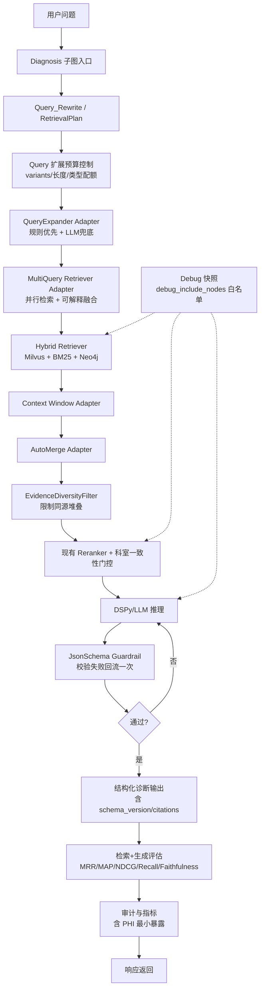

1) 主流生产级 RAG 框架的“可吸收能力”共性（结合当前项目，归纳截至 2026-02-27）

把“RAG 升级”拆开看，生产系统通常围绕同一套五层增强：

检索层（Retrieval Recall）：
- 多查询扩展（Query Expansion）+ 并行召回（Multi-Query Retrieve）提升 recall。
- 稀疏/稠密混合检索后统一去重、融合、重排，并保留可解释来源。

上下文层（Context Shaping）：
- 不是只返回 top-k chunk，而是做窗口扩展（Sentence Window）与父块回并（Auto-Merge）。
- 在长上下文中做位置优化（避免“信息埋在中间”），并控制同源证据过度堆叠。

生成层（Generation Guardrail）：
- 输出必须结构化（JSON Schema）并可自动回流修复。
- 业务规则裁决优先于模型自由输出（结构正确不代表内容安全）。

评估层（Evaluation）：
- 不只看最终答案质量，还要拆分检索指标（MRR/MAP/NDCG/Recall）。
- 形成持续基线与回归门禁，而非一次性离线评测。

治理层（Debug + Reliability）：
- 复杂 pipeline 需要可断点、可快照、可回放。
- 异步并发执行、失败降级、指标留痕与隐私最小暴露是默认能力。

结论：
- 当前项目已经具备“医疗域深定制检索内核”（科室门控、pure 模式、GraphRAG、双缓存）。
- 升级1重点应是“补组件化能力短板”，而不是“整体替换 LangGraph 主流程”。


2) smart_hospital_agent 对应业务流程图（升级1：增量吸收式 RAG）




3) smart_hospital_agent 升级1计划书（RAG 能力吸收版）

0. 计划目标（2026 Q2）

在不替换现有 LangGraph 主编排前提下，吸收 Haystack 的高价值 RAG 组件能力：
- 提升召回（多查询并行）。
- 提升上下文质量（窗口扩展/分层回并/证据多样性）。
- 提升输出稳定性（JSON Schema 校验回流 + 版本化）。
- 提升可评估与可调试性（检索指标基线 + 白名单快照）。


1. 需求合理性分析（为什么现在做）

业务合理性：
- 现有系统已可用，但在复杂病例描述、长文本上下文与格式稳定性上仍有优化空间。
- 升级1可在不改动主链路的情况下，提升召回与可解释性，风险可控。

技术合理性（结合当前仓库）：
- 已有混合检索核心：`backend/app/rag/retriever.py`
- 已有 GraphRAG 并发检索：`backend/app/rag/graph_rag_service.py`
- 已有查询规划：`backend/app/rag/retrieval_planner.py`
- 已有科室一致性门控与 pure 模式：`backend/app/rag/retriever.py`
- 已有 RAGAS 评估脚本：`backend/app/rag/rag_evaluator.py`

核心缺口：
- 查询扩展与多查询并行尚未组件化标准落地。
- 层级索引已留网关但后端仍为空（Noop）。
- 生成结果缺少 schema 级自动纠偏回路与版本管理。
- 评估侧缺少检索指标门禁与持续回归基线。
- 缺少通用断点快照机制用于复杂链路调试。
- 快照/评估日志缺少 PHI 最小化硬约束。


2. To-Be 总体架构原则（生产标准）

- 不替换主图：保持 LangGraph 结构不变，按节点增量接入。
- 适配优先：优先做 adapter 层，避免内核大改。
- 规则优先：医疗安全规则裁决优先于模型输出。
- 可回退：每个新增能力均有开关，默认可降级到现有行为。
- 可评估：每次升级必须有离线基线 + 在线指标。
- 可追溯：关键节点保留结构化日志与可回放快照。
- 隐私最小化：默认不落患者原文，仅落必要最小证据标识。


2.1 强制吸收清单（按优先级）

P0（必须）：

P0-1 QueryExpander + MultiQuery 并行召回适配：
- 在 `query_rewrite_node` 后新增扩展与并行检索适配层。
- 输出统一为 `retrieval_query_variants`，保持与现有状态字段兼容。
- 扩展预算硬控（必须）：
  - `max_variants`（建议 3~5）
  - `max_query_len_per_variant`（超长截断）
  - `rewrite_type_budget`（同义改写/纠错/扩展背景词各自上限）
- 多查询融合策略显式化（必须）：
  - `fusion_method` 显式输出：`rrf|weighted_rrf|concat_merge`
  - 默认 `weighted_rrf`，保留 `original_only` 回退开关
- 融合可解释（必须）：
  - 保留 `variant_hits_map`（每个变体命中明细）
  - 保留 `topk_source_ratio`（最终 topK 来自原 query 与扩展 query 的占比）
- DoD：复杂查询 recall@k 提升、p95 延迟增幅可控（<= 25%）、线上可解释字段完整输出。

P0-2 SentenceWindow / AutoMerge 上下文增强：
- 在 `Hybrid_Retriever` 后增加“上下文重组”节点。
- 两段式落地（必须）：
  - Window：依赖 `source_id/split_id/split_idx` 补邻近上下文
  - Merge：依赖 parent/child 元数据执行父块回并
- 元数据不足时自动降级，不阻断主链路。
- 增加 `EvidenceDiversityFilter`（建议 P0 实装）：
  - 限制同源 chunk 数量上限
  - 鼓励多来源证据（指南/说明书/病历）混排
- DoD：上下文完整性提升，答案忠实度不下降，同源证据堆叠率下降。

P0-3 JsonSchemaValidator 校验回流：
- 对诊断结构化输出执行 schema 校验。
- 回流一次策略（必须）：
  - 回流输入包含：`上次 JSON` + `校验错误摘要` + `schema 关键字段说明`
- Schema 版本化（必须）：
  - 输出与日志必须含 `diagnosis_schema_version`
- 结构与内容双裁决（必须）：
  - Schema 负责结构正确
  - 业务规则负责内容安全（证据不足字段置空或拒答）
- DoD：结构化输出解析失败率下降到可接受阈值（如 < 1%）。

P0-4 检索+生成评估双线基线化：
- 评估拆分为两条线（必须）：
  - 检索线（门禁）：MRR/MAP/NDCG/Recall@k
  - 生成线（抽样+门禁）：Faithfulness/引用覆盖率/拒答正确率
- 与现有 `rag_evaluator.py` 并行保留，不做破坏性替换。
- 基线产品化（必须）：
  - `gold_set` 固定样本：每条问题至少 1 个应命中证据（doc/chunk/version）
  - 指标按科室与问题类型分层统计（诊断/用药/解释）
  - 机器可读：`reports/weekly_baseline.jsonl`
  - 人类可读：`reports/weekly_baseline.md`
- DoD：形成固定样本集 + 自动生成双格式报告 + 发布前红线样本零回归失败。

P1（强烈建议）：
1. Lost-in-the-Middle 上下文排序：
   - 在 prompt 构造前调整文档顺序，降低长上下文遗漏。
   - 策略独立配置：`score_desc|lost_in_middle_mitigate`，并写入 `context_pack.ordering`。

2. 路由组件化收敛：
   - 将分散在 prefilter/triage/retriever 的路由规则沉淀为统一 router adapter。
   - 统一产出 `retrieval_plan`（是否 pure/multi-query/graphrag、证据源优先级）。

3. 断点快照调试能力（对齐 include_outputs_from 思路）：
   - 图执行参数新增 `debug_include_nodes`（节点白名单）。
   - 仅白名单节点落中间产物，避免 PHI/成本/存储爆炸。
   - 快照必须带：`request_id/graph_version/node_version/data_contract_version/schema_version`。

4. PHI/合规最小护栏（建议至少 P1 落地）：
   - 快照默认不落患者原文，只落 `doc_id/chunk_id/hash` 与必要摘要。
   - 评估样本必须脱敏，报告中仅出现样本 id 与指标。

P2（可选加分）：
1. 语义缓存策略升级：
   - 将当前“向量命中 + 分数阈值”扩展为“命中 + 语义一致性校验”双门控。

2. 评估闭环自动化：
   - 评估结果驱动参数建议（top_k/rerank_threshold/query_variants）。


2.2 数据契约（避免后续返工）

`retrieval_query_variants`：
```json
[
  {
    "text": "胃痛怎么办",
    "type": "original|synonym|typo_fix|llm_expand",
    "source": "rule|llm",
    "weight": 1.0,
    "lang": "zh|en|mixed"
  }
]
```

`retrieved_docs`：
```json
[
  {
    "doc_id": "...",
    "chunk_id": "...",
    "score_sparse": 0.0,
    "score_dense": 0.0,
    "score_rerank": 0.0,
    "dept_tag": "消化内科",
    "source_version": "kb_v2026_02",
    "source_type": "guideline|drug_label|emr|paper|graph",
    "authority_level": "A|B|C"
  }
]
```

`context_pack`：
```json
{
  "evidence": ["..."],
  "ordering": "lost_in_middle|score_desc",
  "fusion_method": "weighted_rrf",
  "truncation": {"applied": true, "reason": "token_limit"}
}
```

`diagnosis_output`：
```json
{
  "diagnosis_schema_version": "v1",
  "department_top1": "...",
  "department_top3": ["..."],
  "confidence": 0.0,
  "reasoning": "...",
  "citations": [{"doc_id": "...", "chunk_id": "...", "span": "..." }]
}
```


3. 路线图（升级1：A/B/C/D）

阶段 A（P0，最小可用）：召回增强接入
目标：先把查询扩展 + 并行召回接入，不改变现有主图行为语义。

- A1. 新增 `backend/app/rag/adapters/query_expander_adapter.py`
  完成定义：
  1. 输入原 query，输出扩展后的 queries（含原 query）。
  2. 支持规则扩展优先，LLM 扩展兜底。
  3. 内置预算约束与扩展类型配额。

- A2. 新增 `backend/app/rag/adapters/multi_query_retriever_adapter.py`
  完成定义：
  1. 对 variants 并行检索，统一去重与排序。
  2. 与现有 `search_rag30` 参数对齐（pure_mode、rerank_threshold 等）。
  3. 输出可解释融合数据（variant->hits / source_ratio / fusion_method）。
  4. 默认 `weighted_rrf`，支持开关回退到仅原 query。

A 验收：
1. 不影响现有 `pure_mode` 和科室门控行为。
2. query 复杂场景召回率有可测提升。
3. 回归测试通过，延迟在预算内。
4. 线上可解释字段可用于复盘（variant 命中分布与来源占比完整）。


阶段 B（P0/P1）：上下文重组 + 输出护栏
目标：提升答案上下文质量和结构稳定性。

- B1. 新增 `backend/app/rag/adapters/context_window_adapter.py`
  完成定义：
  1. 基于 `source_id/split_id` 实现邻近窗口拼接。
  2. Merge 在 parent/child 元数据满足时启用。
  3. 加入 `EvidenceDiversityFilter` 限制同源证据堆叠。
  4. 在 prompt 前提供 `ordering_strategy`（含 `lost_in_middle_mitigate`）。

- B2. 新增 `backend/app/rag/adapters/json_schema_guardrail.py`
  完成定义：
  1. 对诊断输出执行 schema 验证。
  2. 失败触发一次修复回流，再失败返回安全模板。
  3. 输出附带 `diagnosis_schema_version`。

B 验收：
1. 结构化输出错误率显著下降。
2. 答案忠实度与可读性指标上升。
3. 长病历场景关键证据漏读率下降。


阶段 C（P1）：评估体系升级
目标：建立“检索+生成”双维评估看板。

- C1. 先建设 `gold_set`（证据级标注：doc/chunk/version）。
- C2. 新增检索指标评测脚本（MRR/MAP/NDCG/Recall）并接入发布门禁。
- C3. 新增生成评估抽样（Faithfulness/引用覆盖率/拒答正确率）。
- C4. 与 `rag_evaluator.py` 报告合并，形成统一周报。
- C5. 输出双格式：`weekly_baseline.jsonl` + `weekly_baseline.md`。

C 验收：
1. 每周可重复生成统一评测报告。
2. 可对比“升级前 vs 升级后”效果。
3. 红线样本发布门禁可执行，且失败可定位到检索或生成链路。


阶段 D（P1/P2）：路由收敛与调试可回放
目标：降低复杂链路维护成本。

- D1. 新增统一 router adapter，收敛 triage/prefilter 路由逻辑。
- D2. 关键节点支持 `debug_include_nodes` 快照白名单。
- D3. router adapter 输出 `retrieval_plan` 并成为下游唯一策略输入。
- D4. 快照输出满足 PHI 最小化与版本化元数据要求。

D 验收：
1. 故障定位时长下降。
2. 复杂病例链路可稳定复现。


4. 边界与非目标（升级1）

- 非目标1：不整体迁移到 Haystack 主框架。
- 非目标2：不重写现有 Milvus/Neo4j 自研融合检索内核。
- 非目标3：不在本阶段改动医疗业务规则决策边界。


5. 风险与应对

- 风险：扩展 query 导致噪声召回上升。
  - 应对：预算硬控 + 可解释融合 + 保留现有 rerank 与科室门控。

- 风险：新增节点拉高延迟。
  - 应对：并行化执行 + 开关灰度 + p95 监控 + 慢查询采样。

- 风险：schema 回流造成循环。
  - 应对：设置最大回流次数（建议 1 次）并强制终止降级。

- 风险：快照/评估触发 PHI 暴露。
  - 应对：默认脱敏 + 明文开关仅在安全环境启用 + 审计留痕。


6. 当前环境可行性与预期效果

可行性判断：可落地。
- 当前环境已具备所需基础组件（Milvus、Neo4j、PostgreSQL、Redis、LangGraph 子图）。
- 升级1采用 adapter 增量接入，不要求替换主框架。

预期效果（针对“识别不准”）：
- 短期（A 阶段）：通过 QueryExpander + MultiQuery，缓解漏召回导致的识别偏差。
- 中期（B 阶段）：通过 Context Shaping + Guardrail，降低证据碎片化与输出漂移。
- 长期（C 阶段）：通过检索基线门禁，持续定位并压降误识别来源。

注意：
- 若根因来自知识库标注质量或覆盖缺失，上述改造是“显著缓解”，不是“一键根治”。


7. 升级1 DoD（完成定义）

1. 文档层：本升级1计划书评审通过并归档。
2. 能力层：A/B 阶段最小链路可开关上线。
3. 质量层：检索与生成指标均有基线报告。
4. 稳定层：故障可回退、可审计、可复盘。
5. 合规模块：快照与评估报告默认满足 PHI 最小暴露策略。


8. 与 Haystack 的吸收映射表（仅能力形态）

| 升级能力 | Haystack 对照能力 | 本项目吸收方式 |
| --- | --- | --- |
| Query 扩展 | QueryExpander | 吸收 query variants 接口与可解释输出结构 |
| 上下文窗口 | SentenceWindowRetriever | 吸收基于 split 元数据的窗口拼接策略 |
| JSON 结构护栏 | JsonSchemaValidator | 吸收 validated/validation_error 回流模式 |
| 调试白名单快照 | include_outputs_from | 吸收按节点选择性输出的调试范式 |

说明：
- 吸收能力接口与治理模式，不迁移 Haystack 主框架实现。
- 继续沿用 Milvus/Neo4j + LangGraph 作为运行底座。


9. 参考吸收源（本次对比结论）

- QueryExpander / MultiQueryRetriever
- SentenceWindowRetriever / AutoMergingRetriever
- JsonSchemaValidator
- Evaluators（MRR/MAP/NDCG/Recall/Faithfulness）
- Pipeline Breakpoint / Snapshot（调试能力）

说明：
- 上述能力按“设计思想 + 适配实现”吸收，不做主框架替换。
- Milvus/Neo4j 仍沿用当前项目现有栈与工程实践。


附录A. 默认参数与开关表（Feature Flags）

| 开关 | 默认值 | 灰度策略 | 回退策略 |
| --- | --- | --- | --- |
| `enable_query_expansion` | `false` | 科室/流量分批开启 | 关闭后仅原 query |
| `enable_multi_query` | `false` | 与扩展同步灰度 | 关闭后走单查询检索 |
| `enable_sentence_window` | `true` | 先低风险科室 | 关闭后保留原 top-k |
| `enable_merge` | `false` | 元数据完整索引先开 | 关闭后仅 window |
| `enable_diversity_filter` | `true` | 先限制同源上限 N=2 | 关闭后仅按分数排序 |
| `enable_schema_guardrail` | `true` | 全量开启 | 关闭后返回原输出 |
| `enable_debug_snapshot` | `false` | 仅安全环境+白名单节点 | 关闭快照写入 |


附录B. 审计字段最小集（医疗合规版）

- 请求与版本：`request_id/graph_version/node_version/data_contract_version/diagnosis_schema_version`
- 检索证据标识：`doc_id/chunk_id/source_version/hash/source_type/authority_level`
- 策略决策：`retrieval_plan/fusion_method/ordering_strategy`
- 质量与门控：`rerank_threshold/gate_hit/reject_reason`
- 模型信息：`model_name/model_version/prompt_version`


附录C. 发布门禁规则（Gate）

1. 红线样本集 0 失败（必须）。
2. 检索线：Recall@k 与 MRR 不低于 baseline（或达到预设提升阈值）。
3. 生成线：Faithfulness 与引用覆盖率不低于 baseline。
4. 合规线：快照与评估报告默认不含患者原文，仅含最小必要标识。


附录D. 外部项目生产化吸收补充（2026-02-28）

结论先行：
- 不新开“升级2”，继续在“升级1”内扩展（新增治理子阶段即可）。
- 吸收“机制与契约”，不吸收“演示实现细节”。
- 保持 LangGraph 主流程不替换，仅在 Diagnosis/Evaluation/Regression 三个面向增量接入。

吸收源一：`/home/kkk/Project/multi-agent-healthcare-rag-langgraph`

建议吸收（生产可落地）：
1. 可答性前置判断（Query Analysis）：
   - 在检索后/生成前增加“是否可基于证据回答”的裁决输入。
   - 输出 `answerability_status` 与 `answerability_reason`。
2. 置信裁决闭环（Confidence + Iteration Gate）：
   - 吸收 `confidence_threshold + max_iterations + fallback` 机制。
   - 低置信不只追问：按原因路由到 `retrieve_more | clarify | reject | human_review`。
3. 裁决理由码标准化：
   - 固定枚举：`insufficient_evidence | conflicting_evidence | high_risk | low_confidence`。
   - 审计日志必须落 `decision_action + decision_reason + confidence_score`。

不建议直接吸收：
- Notebook 内的 FAISS/Groq/Prompt 具体实现（PoC 形态，不适合作为生产基线）。

吸收源二：`/home/kkk/Project/healthcare-ai-model-evaluator`

建议吸收（生产可落地）：
1. 评估作业化模式：
   - 采用 `metricjobs -> metricresults` 的异步评测契约。
   - 支持部分失败不阻塞（单样本失败可记录，整批继续）。
2. 统一数据与结果 schema：
   - 输入必须携带 `request_id / dataset_version / model_version / task_type`。
   - 输出必须包含 `instance_metrics + summary_metrics + failure_stats`。
3. 人审+模型审汇总范式：
   - 支持 reviewer 维度与指标维度分层汇总，生成可追溯周报。
4. 发布门禁工程化：
   - 将周报与 gate 绑定：红线样本 0 失败 + 核心指标不劣化。

不建议直接吸收：
- 整套 Azure Arena UI 与部署栈（当前阶段成本高、与主目标不直接相关）。

吸收源三：`/home/kkk/Project/MedAgentSim`

建议吸收（生产可落地）：
1. 动态回归方法而非代码：
   - doctor/patient/measurement/moderator 多轮场景模板。
   - 覆盖 `追问 -> 检查申请 -> 结果返回 -> 再诊断` 完整流程。
2. 回归协议化：
   - 固定机判事件：`request_test / provide_result / diagnosis_ready / escalate`。
   - 用于验证 Diagnosis 子图的流程质量而非仅答案文本质量。
3. 场景分层：
   - 基础集（20）+ 高风险集（20）+ 对抗偏置集（10）逐层上线。

许可证与合规约束（必须）：
- MedAgentSim 为 `CC BY-NC-SA 4.0`，不得直接复制其代码进入商业/生产路径。
- 仅吸收方法论、交互协议与评测设计，所有实现在本仓库独立重写。

生产落地优先级（在升级1内执行）

P0（优先）：
1. Diagnosis 子图新增裁决治理：
   - 在 `DSPy_Reasoner -> Confidence_Evaluator` 之间补 `Evidence_Verifier`、`Risk_Assessor`、`Decision_Judge`（可合并实现）。
   - 输出字段：
     - `decision_action`
     - `decision_reason`
     - `confidence_score`
     - `grounded_flag`
2. 评估作业化最小闭环：
   - 固定 `weekly_baseline.jsonl/md` 生成流程与 schema。
   - 接发布 gate（红线样本、检索线、生成线）。

P1（随后）：
1. 动态诊断回归集（无前端依赖）：
   - CLI 场景驱动，覆盖追问/补检索/拒答/人工升级四类分支。
2. 评估报告分层：
   - 科室、任务类型、风险等级三维切分。

P2（增强）：
1. 评估结果参数回写：
   - `top_k / rerank_threshold / query_variants / ordering_strategy` 自动建议与灰度。
2. 多评审一致性指标：
   - reviewer 间一致性统计（用于医疗审查支撑）。

阶段命名建议（在升级1路线图内追加）：
- 阶段 E（P0/P1）：置信裁决治理 + 评估作业化 + 动态回归基线。


附录E. 升级1未完成后端问题清单（2026-02-28）

归属说明：
- 以下问题归属“升级1/后端能力层”，不归属升级2前端壳范围。
- 状态均为“未完成”，需继续在升级1路线内闭环。

1) Query_Rewrite 长尾时延本体优化（未完成，P0）
- 现状证据：
  - `logs/e2e_fullchain/20260228_165836/summary.json` 中 `Query_Rewrite` 平均 `37.112s`、最大 `60.43s`。
  - 同批次 `mt_turn4_crisis` 以 `stall_timeout` 结束，卡点在 `Query_Rewrite`。
- 代码侧根因线索：
  - `backend/app/rag/retrieval_planner.py` 的 `_llm_rewrite()` 目前无显式超时保护。
  - `backend/app/core/graph/sub_graphs/diagnosis.py` 的 `query_rewrite_node` 直接等待 `build_retrieval_plan()`。
- 待完成项：
  - crisis 快速专线（跳过慢 rewrite 或规则轻改写）。
  - rewrite 超时硬兜底（建议 3-5s）+ 原 query 回退。
  - 超时/异常打标（`rewrite_fallback=true`, `fallback_reason=timeout|error`）。

2) 多轮上下文串味 / 状态隔离（未完成，P0）
- 现状证据：
  - `logs/e2e_fullchain/20260228_165836/report.md` 中：
    - `mt_turn3_registration` 响应混入上一轮诊断长文本。
    - `mt_turn4_crisis` 响应预览仍为挂号追问语句（跨意图污染）。
- 代码侧根因线索：
  - `backend/app/core/graph/sub_graphs/service.py` 的 `service_agent_node` 将 `messages[-5:]` 直接作为服务上下文，易混入诊断语料。
  - `backend/app/core/graph/nodes/intent_classifier.py` 存在 `prev_intent` 会话纠偏逻辑，跨场景会话需更强隔离策略。
- 待完成项：
  - 服务链路与诊断链路做上下文分区（按 intent/channel 隔离消息窗口）。
  - 为高风险意图（CRISIS）启用独立最小上下文策略，避免继承服务对话残留。
  - 明确 session/thread 的状态重置点与跨路由清理规则。

3) 检索质量与规则策略持续调优（未完成，P1）
- 现状证据：
  - `logs/intent_benchmark/clean500_before_after_20260226_144854/after_intent_summary.json`：
    - 总体准确率 `0.8925`，其中 `CRISIS=0.84`、`GREETING=0.85`。
  - `logs/intent_benchmark/clean500_before_after_20260226_144854/failure_taxonomy_report.json`：
    - 仍存在危机场景被判为 `COMPLEX_SYMPTOM` 的错误样本。
  - 未关闭任务：
    - `smart_hospital_agent-5pm`（Milvus 52k 恢复后质量回归调查）
    - `smart_hospital_agent-5gr`（21 科室自动分类覆盖扩展）
- 待完成项：
  - 危机/寒暄/模糊症状规则继续加固，并补充高风险对抗样本。
  - 科室路由与检索参数分层调优（top_k/rerank_threshold/query_variants）。
  - 将失败样本写回周基线与动态回归集，形成持续门禁闭环。
